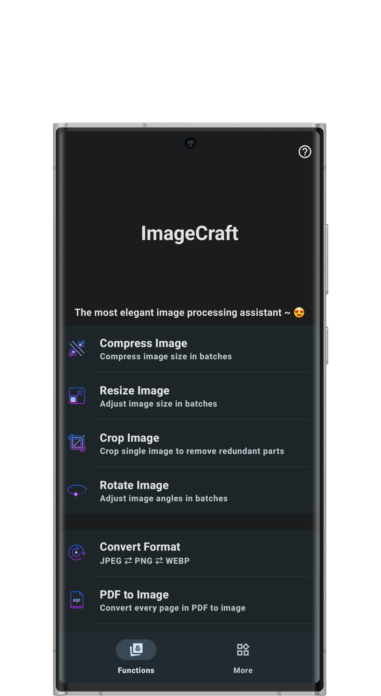
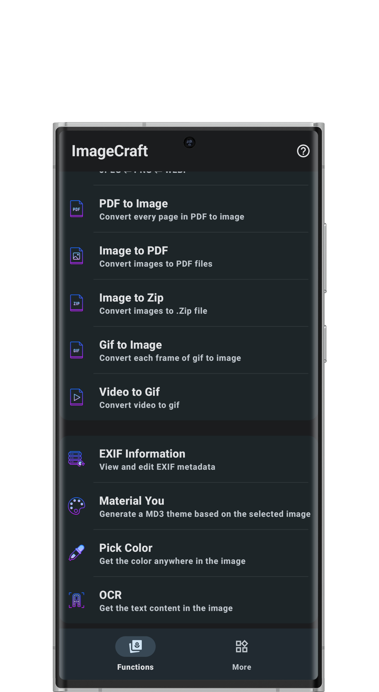
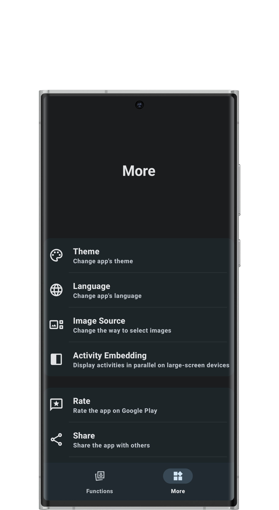
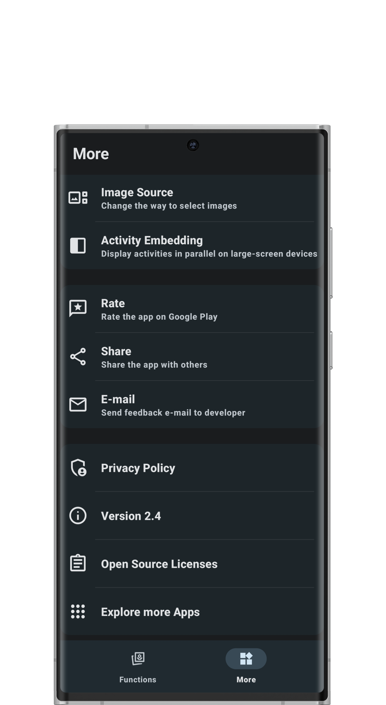
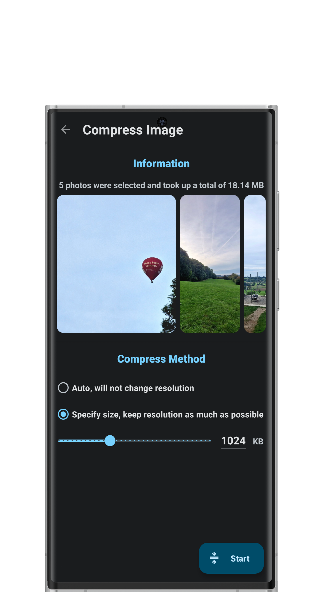
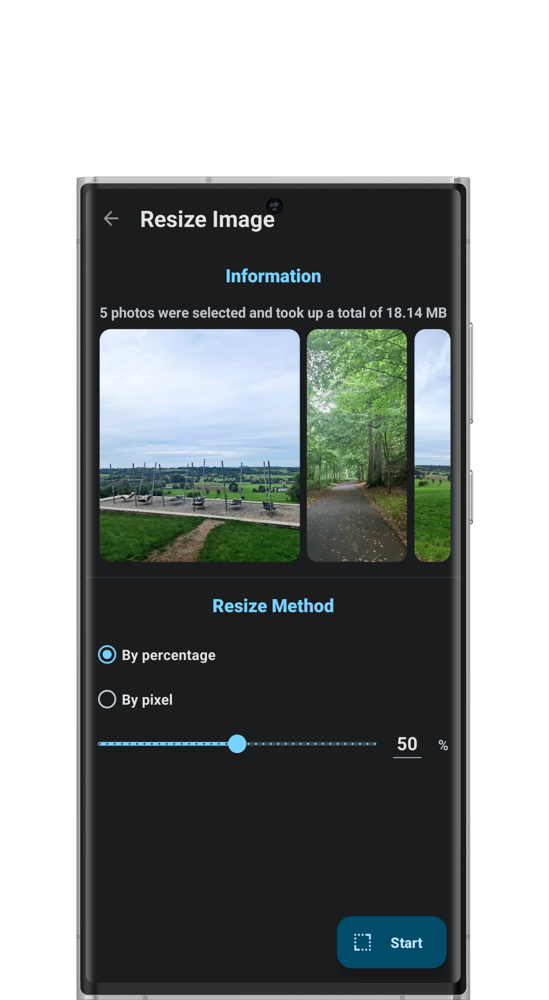
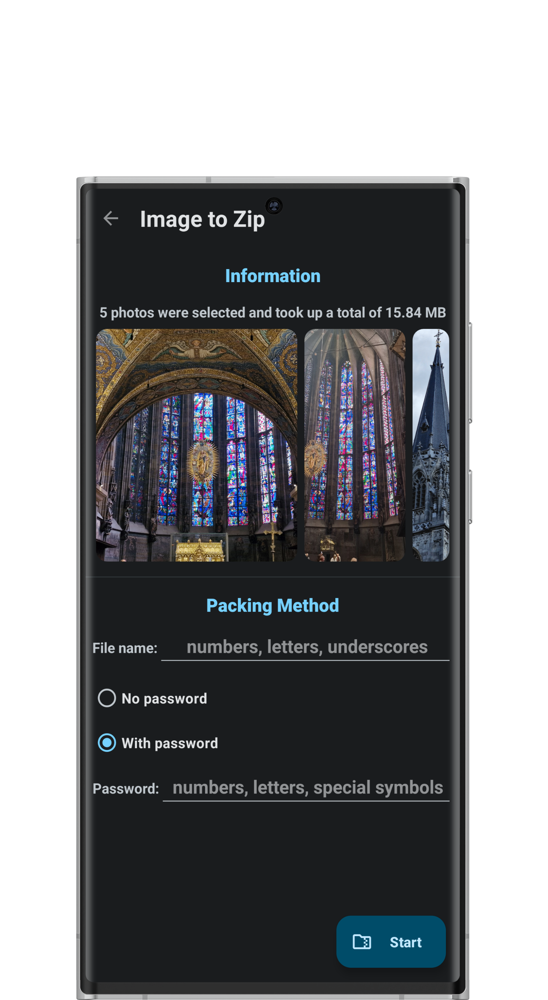
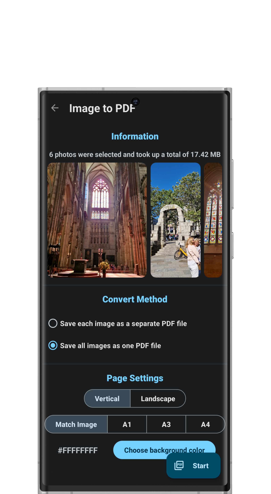
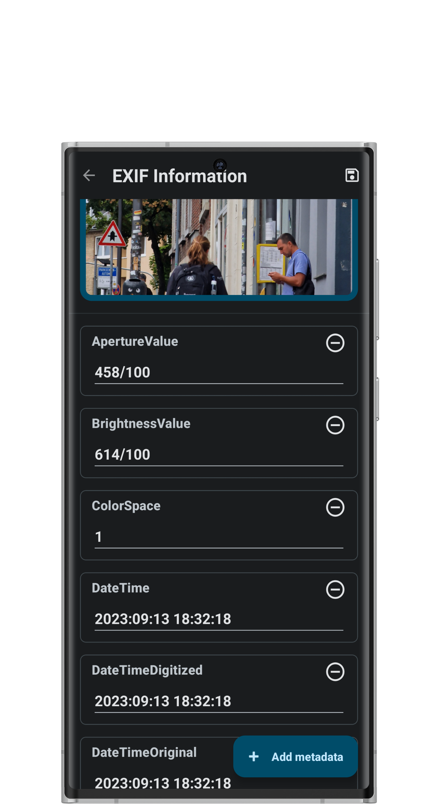
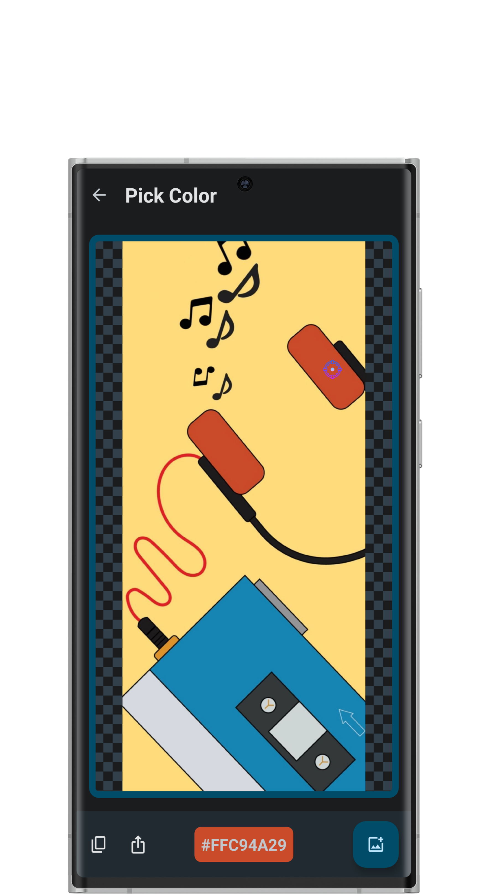

# ImageCraft

### Wonderful image processing app for Android

 

 

## 📖 Features

* No unnecessary permissions required, 
* Material You, 
* Portrait and landscape orientation, 
* Multiple useful functions
* Adapt to the latest Android API(predictive back gesture, photo picker, activity embedding, monochrome theme icon, in-app language switching, etc.)

## 📷 Screenshots

## 🌎 Translations

Currently supports Chinese and English.

## 📃 Application introduction

!!! Code may not be used for profitable commercial purposes without the author's permission.

Main features:

- Batch compression of images: Supports batch compression of single or multiple images, and supports specifying the compression size. The intelligent compression algorithm reduces the space occupied by the picture as much as possible without changing the resolution as much as possible.

- Image batch scaling: Supports size adjustment of single or multiple images, supports scaling based on percentage, and can also customize the resolution of images. Easily meet the special requirements for picture size in some occasions.

- Image cropping: Support image cropping. Got extra? Cut it off!

- Batch rotation of images: Supports rotating or flipping single or multiple images.

- Image batch format conversion: Support conversion between JPEG, PNG, WEBP and other mainstream formats. File format is no longer an issue.

- PDF to image: Save each page in the PDF file as a image, no need to take screenshots one by one.

- Image to PDF: Save the selected single or multiple images as one or more PDF files.

- Image package: Package the selected single or multiple images into one or more compressed files in .zip format, and support password encryption and file name modification.

- Gif to Image: Convert each frame in the gif animation to a picture.

- Video to Gif: Convert short video to gif animation.

- EXIF information: View and edit a image's EXIF metadata.

- Material theme preview: Support to generate the corresponding material theme 3 according to the selected picture, and various controls are available for preview.

- Picture color selection: Pick and view a color anywhere on the picture.

