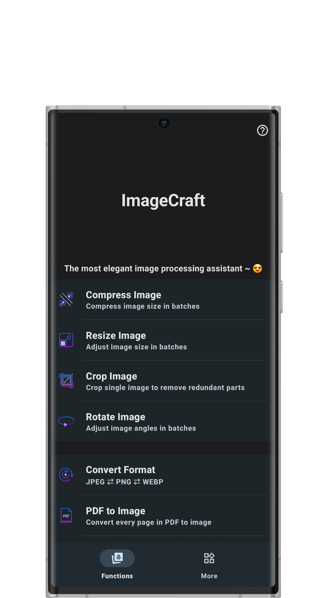
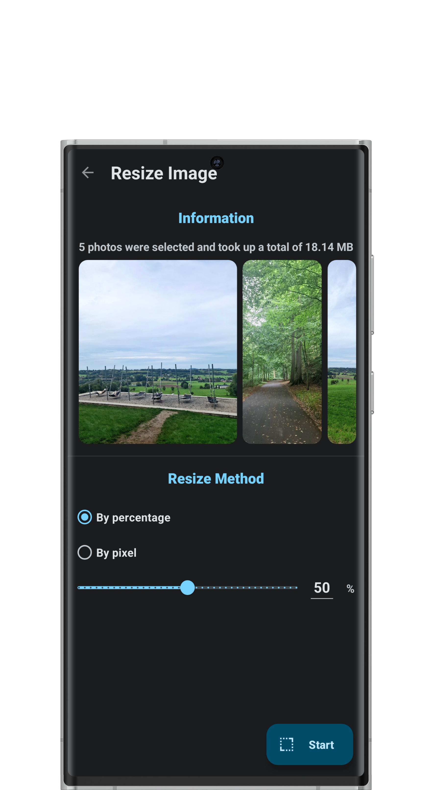
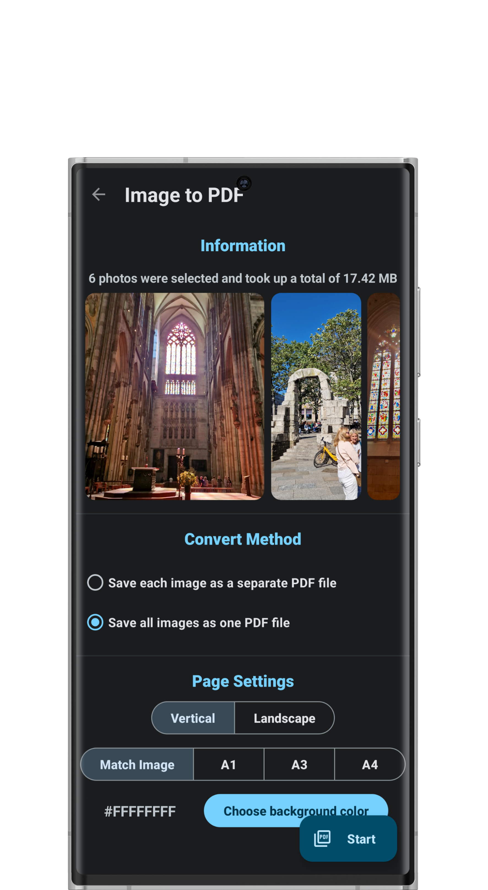

# 图像大师

### 适用于安卓的一站式图像处理解决方案

 

 

## 📖 特点

* 无不必要的权限
* 材料主题3
* 适配不同大小和方向的屏幕
* 多项实用功能
* 适配最新安卓特性(预测新返回手势、图片选择器、活动嵌入、单色主题图标、应用内语言切换等)

## 📷 屏幕截图

## 🌎 语言翻译

目前支持中文和英语。

## 📃 应用介绍

!!! 未经作者允许不得将代码用于盈利性商业用途。

主要功能：

- 图片批量压缩： 支持对单张或者多张图片进行批量压缩，支持指定压缩大小。智能压缩算法，在尽量不改变分辨率的情况下，尽可能缩小图片占用的空间。

- 图片批量缩放： 支持对单张或者多张图片进行尺寸调节，支持根据百分比缩放，也可自定义图片的分辨率。轻松满足一些场合对于图片尺寸的特殊要求。

- 图片裁剪： 支持对图片进行裁切。有多余的部分？裁掉！

- 图片批量旋转： 支持对单张或多张图片经行旋转或翻折。

- 图片批量格式转换： 支持在 JPEG、PNG、WEBP等主流格式之间的转换。文件格式从此不再是问题。

- PDF转图片： 将PDF文件中的每一页保存成图片，从此不用再一张一张截图。

- 图片转PDF： 将所选的单张或多张图片保存为一个或多个PDF文件。

- 图片转压缩包： 将所选的单张或多种图片打包成一个或多个.zip格式的压缩文件，支持密码加密和修改文件名。

- Gif转图片： 将Gif动图中的每一帧转为图片。

- 视频转Gif： 将短视频转为Gif动图。

- EXIF信息： 查看并编辑图片的EXIF元数据。

- 材料主题预览： 支持根据选择的图片，生成对应的材料主题3，多种控件可供预览。

- 图片取色： 选取并查看图片上任意位置的颜色。

